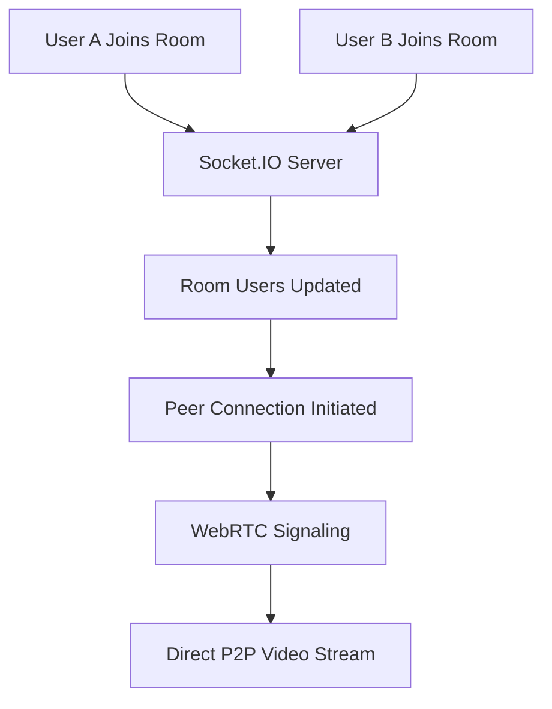

# 🕵️ StealthChat - Secure WebRTC Video Calling App

<div align="center">


**A secure, privacy-focused video calling application built with Next.js and WebRTC**

[](https://nextjs.org/)
[](https://reactjs.org/)
[](https://socket.io/)
[](https://webrtc.org/)
[](https://tailwindcss.com/)

[Demo](#demo) • [Features](#features) • [Installation](#installation) • [Usage](#usage) • [API](#api) • [Contributing](#contributing)

</div>

---

## 🚀 Demo

<!-- Add screenshots or GIF here -->


**Live Demo:** [stealthchat-demo.vercel.app](#) *(Coming Soon)*

---

## ✨ Features

### 🎯 Core Video Calling
- **Secure real-time video/audio calls** using WebRTC technology
- **Private room-based communication** with shareable links
- **Multiple participants** support with peer-to-peer connections
- **Device switching** (camera/microphone selection)
- **Media controls** (mute/unmute, camera on/off)

### 🔒 Privacy & Security
- **No data collection** - all communication is peer-to-peer
- **No account required** - anonymous joining with temporary names
- **No call recording** by default - your privacy is protected
- **Local storage only** - usernames saved locally, never on servers
- **Direct connections** - video never passes through our servers

### 🎨 Advanced UI/UX
- **Pin/Unpin videos** with dynamic layout switching
- **Responsive grid layout** that adapts to participant count
- **Hover-based controls** for clean, minimalist design
- **Real-time user list** showing all room participants
- **Persistent username** storage across sessions

### 🔧 Technical Features
- **URL-based room joining** for easy sharing
- **Automatic room creation** when no room ID specified
- **Socket.IO real-time signaling** for connection management
- **Collision-free peer connections** using ID precedence
- **Clean state management** with React hooks

### 📱 User Experience
- **No registration required** - join instantly with a name
- **Copy shareable room links** with one click
- **Auto-save username** in localStorage
- **Device settings** locked during calls for stability
- **Read-only room IDs** when joining via shared links

---

## 🛠 Technology Stack

| Technology | Purpose | Version |
|------------|---------|---------|
| **Next.js** | React framework with App Router | `15.3.4` |
| **React** | Frontend library | `19.0.0` |
| **Socket.IO** | Real-time bidirectional communication | `4.8.1` |
| **Simple Peer** | WebRTC wrapper for easy P2P connections | `9.11.1` |
| **Tailwind CSS** | Utility-first CSS framework | `4.1.11` |
| **Lucide React** | Modern icon library | `0.525.0` |

---

## 📦 Installation

### Prerequisites
- **Node.js** 18+ and npm
- **Modern browser** with WebRTC support
- **Camera and microphone** access

### Quick Start

```bash
# Clone the repository
git clone https://github.com/fixmylifedesigns/stealthchat.git
cd stealthchat

# Install dependencies
npm install

# Start development server
npm run dev

# Open your browser
open http://localhost:3000
```

### Production Build

```bash
# Build for production
npm run build

# Start production server
npm start
```

---

## 🎮 Usage

### Creating a Room

1. **Open the app** at `http://localhost:3000/stealthchat`
2. **Enter your name** (saved automatically for future visits)
3. **Select camera/microphone** from device settings
4. **Click "Create Room"** to generate a new room
5. **Share the URL** with others to join

### Joining a Room

1. **Click a shared room link** (e.g., `/stealthchat?call=ROOM_ID`)
2. **Enter your name** (room ID is pre-filled and read-only)
3. **Select your devices** before joining
4. **Click "Join Room"** to connect

### During a Call

| Action | How To |
|--------|--------|
| **Pin a video** | Hover over video → Click pin icon |
| **Unpin video** | Click unpin icon on pinned video |
| **Mute/unmute** | Click microphone button (your video only) |
| **Camera on/off** | Click camera button (your video only) |
| **Copy room link** | Click copy button in "Your Information" |
| **Leave room** | Click "Leave Room" button |

---

## 🏗 Architecture

### Project Structure

```
src/
├── app/
│   ├── api/socket/route.js          # Socket.IO server endpoint
│   ├── globals.css                  # Global styles
│   ├── layout.js                    # Root layout
│   └── stealthchat/page.jsx         # Main video call page
├── components/VideoCall/
│   ├── VideoCallApp.js              # Main application logic
│   ├── VideoPlayer.js               # Individual video component
│   ├── DeviceSettings.js            # Camera/mic selection
│   ├── RoomControls.js              # Room management UI
│   ├── UserList.js                  # Participant list
│   └── IncomingCallModal.js         # Call notification modal
└── hooks/
    └── useSocket.js                 # Socket.IO hook (unused)
```

### Real-time Communication Flow



### Socket.IO Events

| Event | Direction | Purpose |
|-------|-----------|---------|
| `join-room` | Client → Server | Join a specific room |
| `leave-room` | Client → Server | Leave current room |
| `calling-user` | Client → Server | Initiate peer connection |
| `accepting-call` | Client → Server | Accept incoming call |
| `room-users` | Server → Client | Updated participant list |
| `user-joined` | Server → Client | New user notification |
| `user-left` | Server → Client | User disconnect notification |
| `receiving-call` | Server → Client | Incoming call signal |
| `call-accepted` | Server → Client | Call acceptance signal |

---

## ⚙️ Configuration

### Environment Variables

```bash
# Not required for basic functionality
# Socket.IO runs on port 5001 by default
```

### Browser Requirements

| Browser | Minimum Version | Notes |
|---------|----------------|-------|
| **Chrome** | 60+ | Best performance |
| **Firefox** | 60+ | Full feature support |
| **Safari** | 12+ | Basic functionality |
| **Edge** | 79+ | Chromium-based |

---

## 🔧 API Reference

### Room Management

```javascript
// Join a room
socket.emit('join-room', {
  roomId: 'unique-room-id',
  name: 'User Name'
});

// Leave a room
socket.emit('leave-room', roomId);
```

### Peer Connection

```javascript
// Initiate call
socket.emit('calling-user', {
  userToCall: 'target-user-id',
  signalData: peerSignal,
  from: 'caller-id',
  name: 'Caller Name'
});

// Accept call
socket.emit('accepting-call', {
  signal: answerSignal,
  to: 'caller-id'
});
```

---

## 🚧 Roadmap

### 🎯 Phase 1: Core Enhancements
- [ ] **Background replacement** (blur, custom images)
- [ ] **Screen sharing** capability
- [ ] **Chat messaging** during calls
- [ ] **Recording functionality**

### 🎯 Phase 2: Advanced Features
- [ ] **Noise cancellation**
- [ ] **Virtual backgrounds with AI**
- [ ] **Breakout rooms**
- [ ] **Hand raising** and reactions

### 🎯 Phase 3: Platform Features
- [ ] **Mobile app** (React Native)
- [ ] **Calendar integration**
- [ ] **Meeting scheduling**
- [ ] **User accounts** and history

---

## 🐛 Known Issues

| Issue | Status | Workaround |
|-------|--------|------------|
| Device switching drops connection | 🔧 Fixed | Devices locked during calls |
| Auto-join on typing | 🔧 Fixed | Manual join only |
| Dual call initialization | 🔧 Fixed | ID-based precedence |
| Port 5001 conflicts | ⚠️ Known | Kill existing processes |

---

## 🤝 Contributing

We welcome contributions! Please see our [Contributing Guide](CONTRIBUTING.md) for details.

### Development Setup

```bash
# Fork and clone the repo
git clone https://github.com/fixmylifedesigns/stealthchat.git

# Create feature branch
git checkout -b feature/awesome-feature

# Make changes and test
npm run dev

# Commit with conventional commits
git commit -m "feat: add awesome feature"

# Push and create PR
git push origin feature/awesome-feature
```

### Code Style

- **ESLint** configuration included
- **Conventional commits** preferred
- **Component-based** architecture
- **Comprehensive logging** for debugging

---

## 📄 License

This project is licensed under the **MIT License** - see the [LICENSE](LICENSE) file for details.

---

## 🙏 Acknowledgments

- **WebRTC** community for excellent documentation
- **Socket.IO** for real-time communication
- **Simple Peer** for WebRTC abstraction
- **Next.js** team for the amazing framework
- **Tailwind CSS** for utility-first styling

---

## 📞 Support

- **Issues**: [GitHub Issues](https://github.com/fixmylifedesigns/stealthchat/issues)
- **Discussions**: [GitHub Discussions](https://github.com/fixmylifedesigns/stealthchat/discussions)
- **Email**: [contact@duranirving.com](mailto:contact@duranirving.com)

---

<div align="center">

**Built with ❤️ by [Irving](https://github.com/fixmylifedesigns)**

[⭐ Star this repo](https://github.com/fixmylifedesigns/stealthchat) if you found it helpful!

</div>